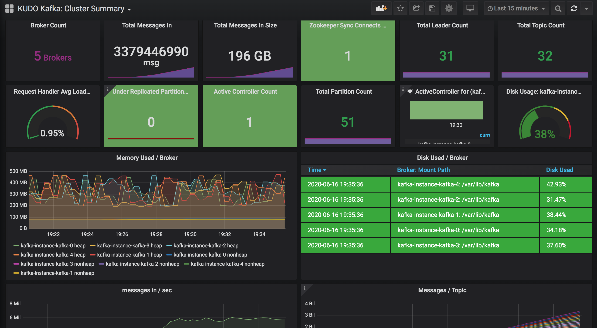
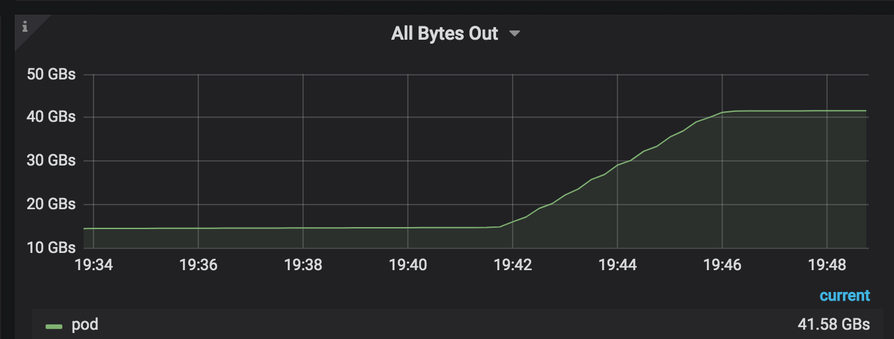

# MWT plan

The MWT (mixed workload test) benchmark is designed to follow next steps:

1. run a KUDO Kafka instance with these params: 
    ```
    BROKER_CPUS: "2000m"
    BROKER_COUNT: "5"
    BROKER_MEM: "4096m"
    DISK_SIZE: "100Gi"
    MIN_INSYNC_REPLICAS: "1"
    NUM_IO_THREADS: "15"
    NUM_NETWORK_THREADS: "10"
    ADD_SERVICE_MONITOR: "true"
    ``` 
1. run deployment of 100 replicas of [consumer and producer workload](./mwt/workload-large/00-mwt-workload/workload.yaml)
1. move to producer intensive workload 199 pods of producer pods and 1 pod of consumer workload 
    ```
    - reach to 6M msgs/sec
    ```
    
1. move to consumer intensive workload 199 pods of consumer pods and 1 pod of producer workload 
    ```
    - reach to 40G/sec of bytes out
    ```
    


# Automation of the MWT using KUTTL

The above mentioned plan is automated using KUTTL 

## Prerequisites

- Kubernetes cluster up
- KUDO CLI installed on node kuttl is running from
- KUDO manager installed in the cluster

# TestSuites

- **Setup:** used to setup a MWT test use the following command

` KAFKA_PARAMETER_FILE=params-mwt kubectl kuttl test setup/ --parallel 1 --skip-delete`

or

` KAFKA_PARAMETER_FILE=params-mwt kubectl kuttl test --config kuttl-setup.yaml`


- **Teardown:** used to remove zookeeper/kafka (and verify it has been removed)

`kubectl kuttl test --config kuttl-teardown.yaml`

## Tests under **Setup**

- 00-kudo-check: confirms

  1. commands locally are present
  1. kudo manager is ready at the server

- 01-zookeeper-install
  1. first creates and asserts "kafka-mwt" namespace exists
  1. installs the zookeeper operator CRDs and asserts they exist
  1. installs zookeeper and asserts that the deployment plan is
     complete
     
- 02-kafka-install
  1. installs the kafka operator CRDs and asserts they exist
  1. installs kafka and asserts that the deployment plan is
     complete
     
- 03-dashboard-install
  1. installs the grafana configmap dashboard, that is loaded by the grafana operator.
   Test expects the operator to reading the kubeaddons namespace

## Workloads 

The current configuration comes with two workloads types `small` and `large` 

`small` is intended to run in a KIND or local cluster. `large` is for a cluster that should be ready for production usage.

```
kubectl kuttl workload-small/
```

```
kubectl kuttl workload-large/
```

These commands can be ran consequently and won't create a parallel workloads but would just change the size of workload. 
     
## Verification

run the next command to setup the utils pod we will use for verification

```
kubectl kuttl verify-workload/
```

Now that kuttl confirms that utils pod is up and ready, we can exec inside the pod to run verifications

```
kubectl exec -ti deploy/utils-pod -n kafka-mwt -- sh
```

messages in:
```
curl "prometheus-kubeaddons-prom-prometheus.kubeaddons.svc.cluster.local:9090/api/v1/query?query=kafka_server_BrokerTopicMetrics_MessagesIn_total\{namespace='kafka-mwt',service='kafka-instance-svc',topic=''\}" | jq -r .data.result[].value[1] | awk '{ sum += $1 } END { print sum }'
```

message rate:

```
curl "prometheus-kubeaddons-prom-prometheus.kubeaddons.svc.cluster.local:9090/api/v1/query?query=sum(rate(kafka_server_BrokerTopicMetrics_MessagesIn_total\{service='kafka-instance-svc',namespace='kafka-mwt',topic=''\}\[1m\]))" | jq -r .data.result[].value[1]
```

Alternative approach is to monitor the dashboard installed with the `setup`

**NOTES:**

1. The MWT parameter values need to be changed. This was built and tested on
   konvoy but not on a MWT env
2. The timeouts may need to change. In particular the wait for namespace, the
   wait for deploy to finish and the wait for deletes.
3. This was tested with konvoy with config setting established with
   `./konvoy apply kubeconfig --force-overwrite`
